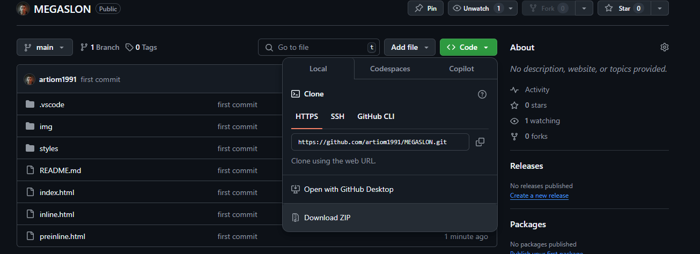
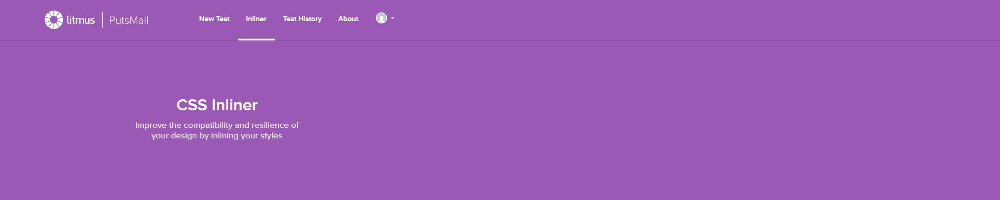
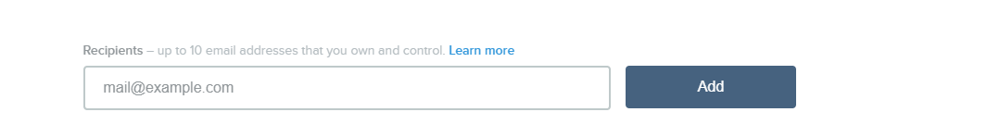
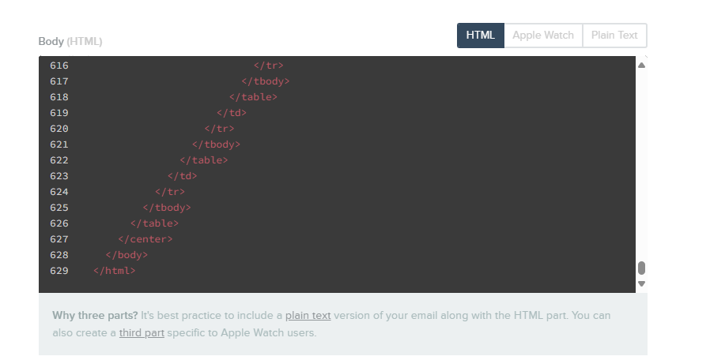
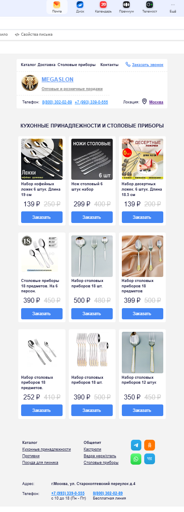
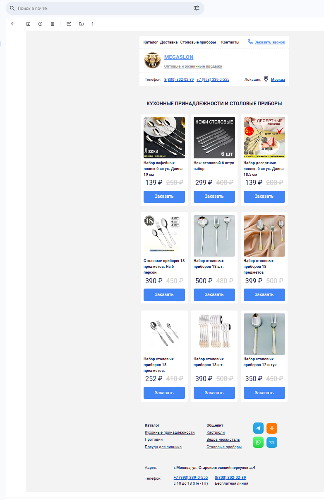
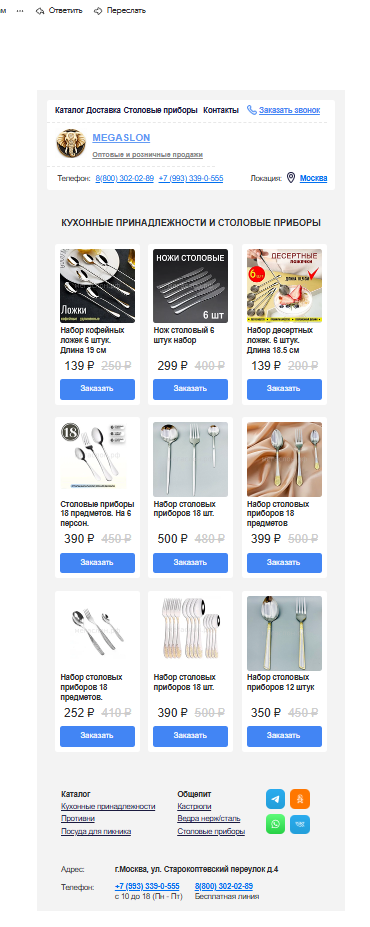

# Шаблон и исходники почтовой рассылки

## Чтобы скачать
Пример того как скачать проект со вмеми файлами
> 

## Содержимое архива
В архиве находятся:
- Локальная копия шаблона `.fig`
- Исходный код свёрстаного шаблона
- Инлайновый вариант котороый можно рассылать `inline.html`

## Провирить можно на сервисе putsmail.com 
Сервис для рассылок [putsmail](https://putsmail.com/)  

В разделе `New Test` можно сделать тестовую рассылки

Далее нужно ввести почту куда будет прислано тестовое письмо и нажать `Add`

Затем в поле `Body (HTML)` скопировать содержимое из `inline.html`

И последнее нажать `Send Email` для отправки

## Проверил на популярных почтовых сервисах

Проверил на `yandex`, `mail`, `gmail`  на компьютерной версии и мобильной и все коректно отображается

